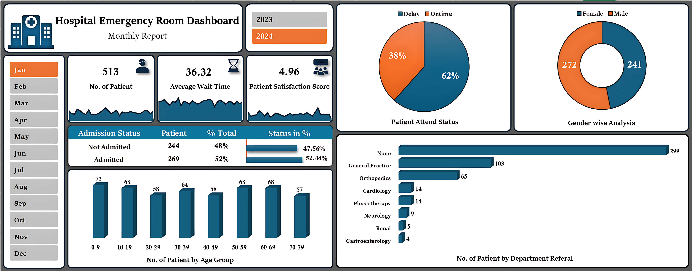

# Hospital Emergency Room Dashboard using Ms-Excel

## Overview
This project involves a comprehensive analysis of a Hospital Emergency Room's operational data using Excel for data processing and Power Pivot. The goal was to build an interactive dashboard to visualize key performance indicators (KPIs), monitor patient flow, and identify areas for improving efficiency and patient satisfaction. The dashboard provides stakeholders with actionable insights for better decision-making and resource management.

## Objectives

- Analyze and visualize patient admission rates (Admitted vs. Not Admitted).
- Track and evaluate patient wait times and the percentage of patients seen within the target time.
- Measure and report on patient satisfaction scores.
- Understand patient demographics through age group and gender distribution analysis.
- Identify the most common departments for patient referrals from the ER.
- Create a dynamic, user-friendly dashboard for monthly reporting and trend analysis.

## Dataset

The sourced dataset for this project:

- **Dataset Link:** [Hospital ER Dataset](https://drive.google.com/file/d/1tSAlOjV-6XFjJpfE9C4u38uU4iD-tNVf/view?usp=drive_link)

## Key Requirements
1. Project Workflow
   

